# unity 项目demo以及学习项目

## demo1 Apple Picker Prototype “捡苹果”
1. 实现了简单的捡苹果逻辑
2. 利用button 实现了不同scene之间的**切换**和游戏的**退出**
3. 利用PlayerPrefs 保存**历史最佳数据**
- 实现逻辑：
    - 树随机移动 掉落苹果
    - 篮子有三次机会接苹果，并且记录历史最高纪录
    - 超过三次，游戏退出到主界面

> 主界面-用于开始游戏和退出
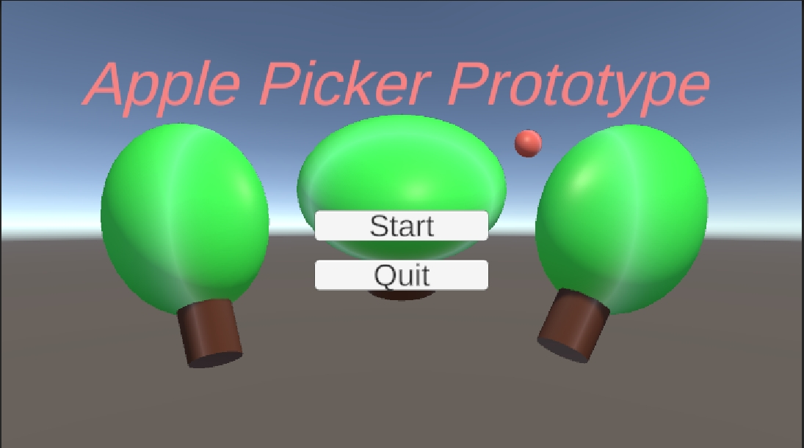

> 游戏界面-进行游戏
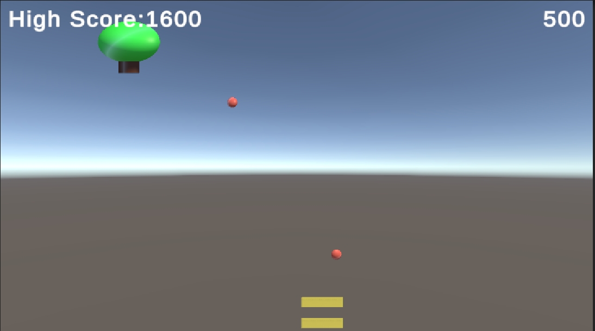

## demo2 Mission Demolition Prototype “愤怒的小鸟”
1. 用Object制作弹弓、子弹、云朵和城堡
2. 利用当前鼠标位置判断当前点是否可发射子弹，并且发射后可以记录子弹的轨迹
3. 同样可以记录到最高纪录
4. 设计一个button 可以自己切换摄像机的中心位置
    - 依次聚焦到 发射点、高塔、以及两者都显示
5. 云朵通过设计一个类，多个簇来实现多云朵的效果

- 当子弹打到绿色区域后，进入下一关

> 游戏界面-第一小关
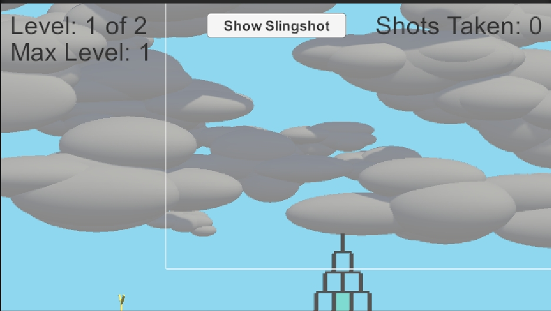

> 游戏界面-第二小关
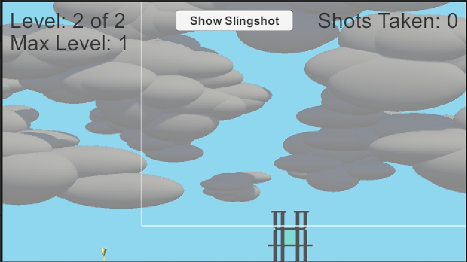

> 游戏界面-聚焦到弹弓上
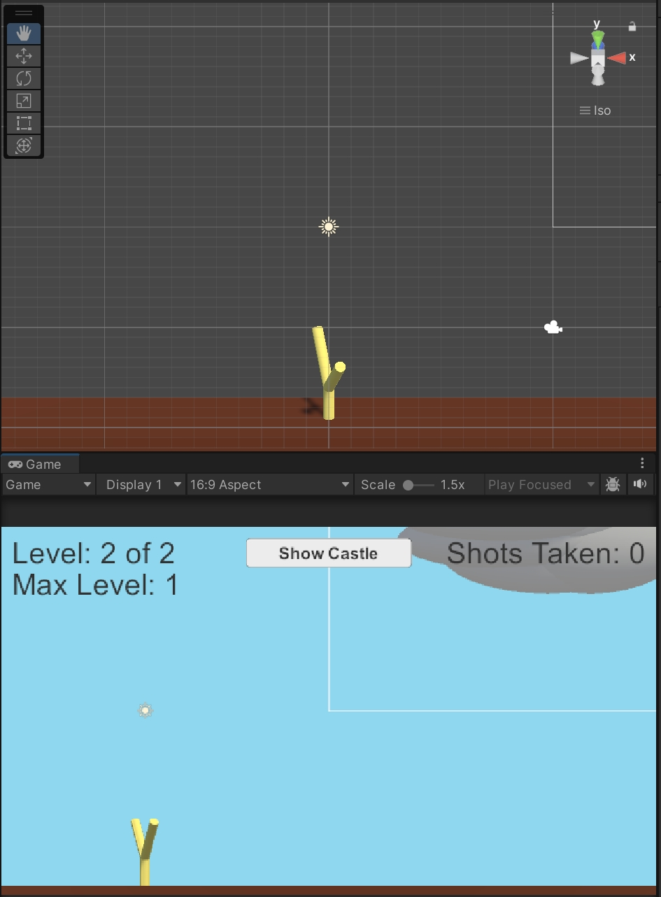

> 游戏界面-子弹发射轨迹
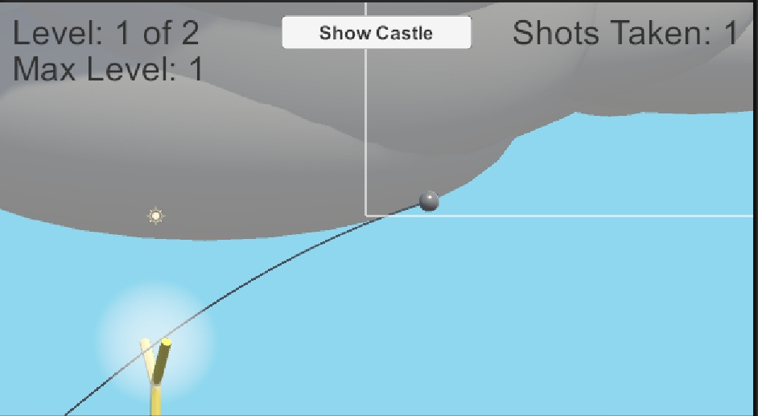

> 游戏界面-聚焦到城堡上
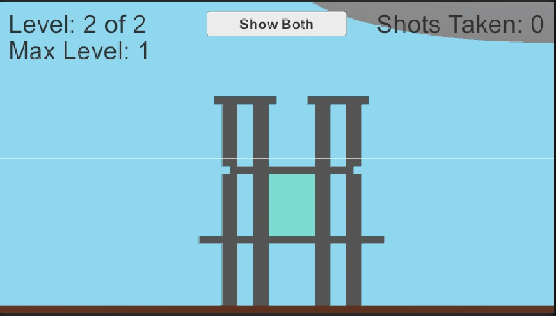

## demo3&4 Space SHMUP Prototype I & II “雷电游戏”标准版& PLUS
1. 通过Quaternion.Euler让飞碟在2D画面中旋转，呈现3D效果
2. 给飞机设置护盾，并且可以通过射击敌人，得到随机的掉落来升级飞碟的护盾和子弹系统
3. 设置4种不同的敌人类型，并且各有不同的运动方式和血量，以及掉率。
4. 敌人受击，闪烁红色。
5. 加入双层背景移动效果，让游戏更动态。

- 如果飞碟的护盾消失且碰到敌人，重新开始游戏。

> 游戏界面-基础版本
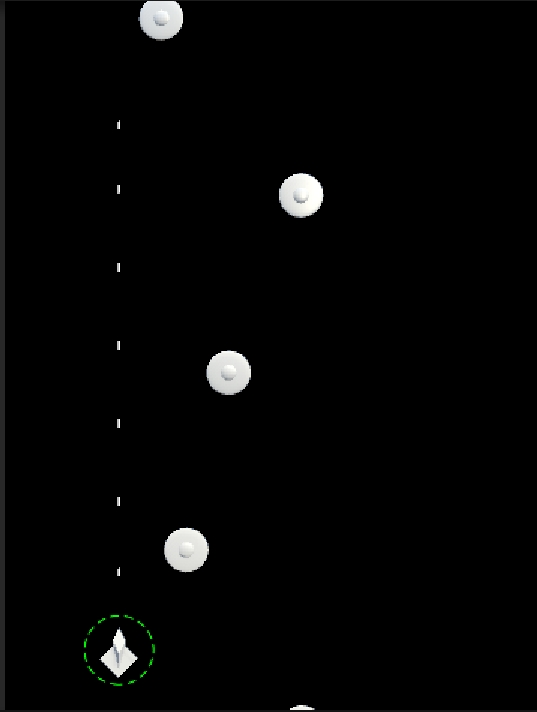

> 游戏界面-Plus版本
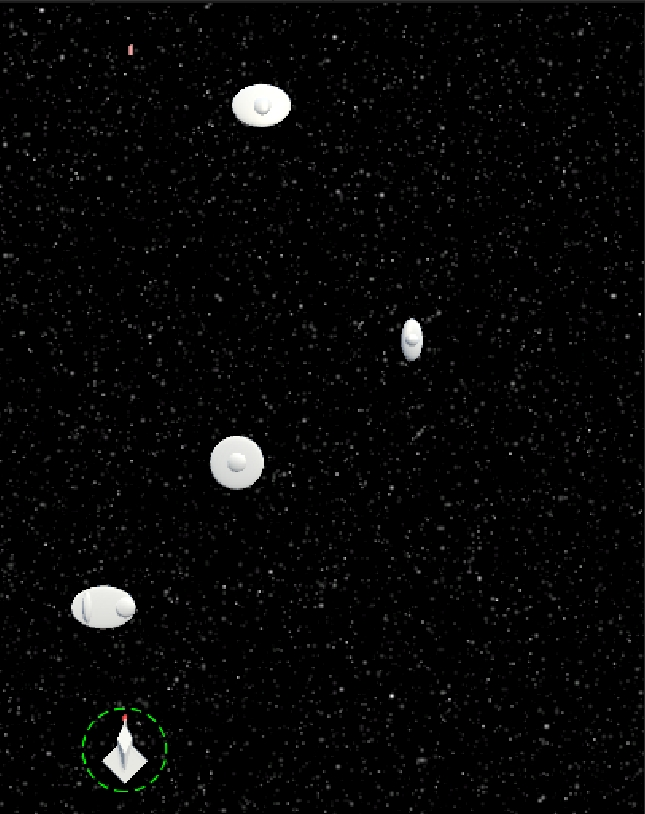

## demo5 Prospector Solitaire “矿工接龙”
1. 利用XML文件来进行纸牌的**拼贴**以及**排布**(矿石状)
2. 给分数设立一个系统，让其能够记录历史最高纪录，连击记录以及动态加分

- 如果游戏结束，重新开始游戏

> 游戏界面-游戏进行时
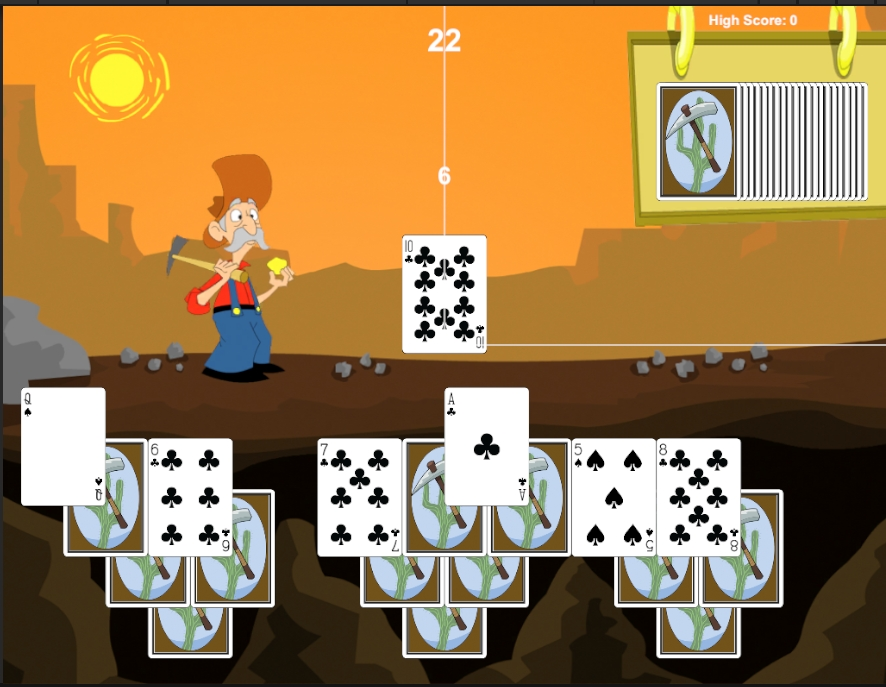

> 游戏界面-成功界面
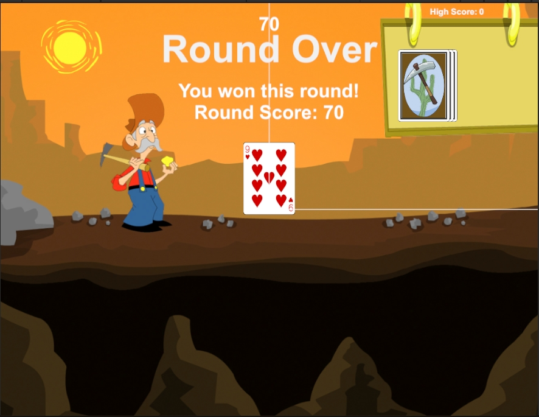

> 游戏界面-失败界面
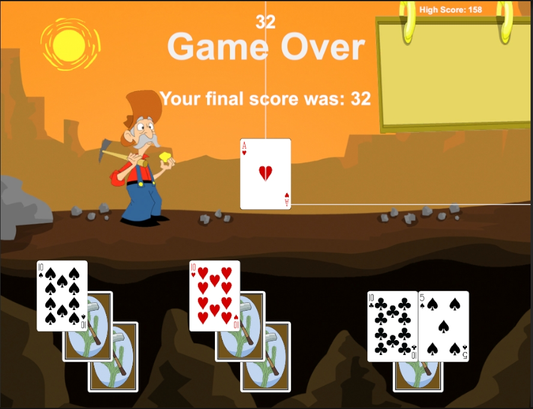

> 游戏界面-动态加分界面
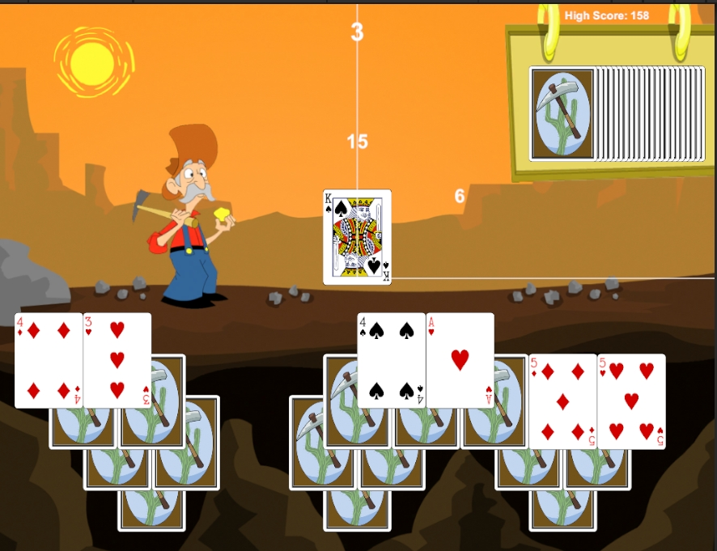

## demo6 Bartok “纸牌UNO”
1. 设置**玩家AI**，按照逻辑进行出牌
2. 根据XML进行分布排列
3. 当谁出牌时，高亮进行提醒

- 游戏结束，重新开始游戏

> 游戏界面-游戏进行时
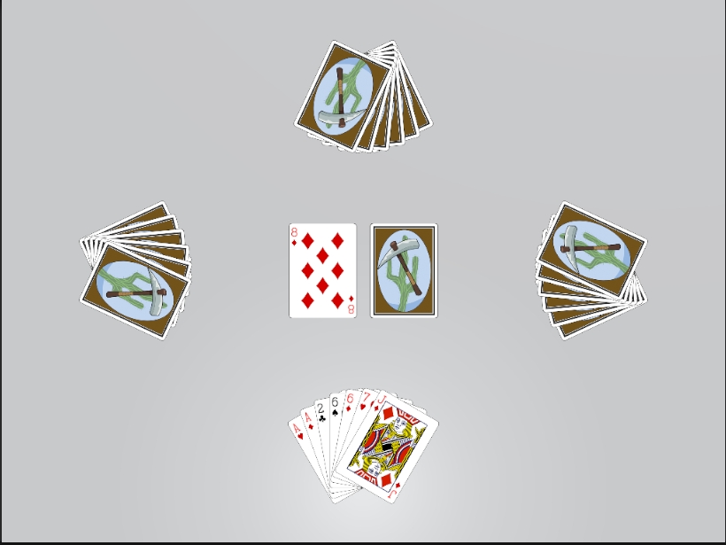

> 游戏界面-失败界面
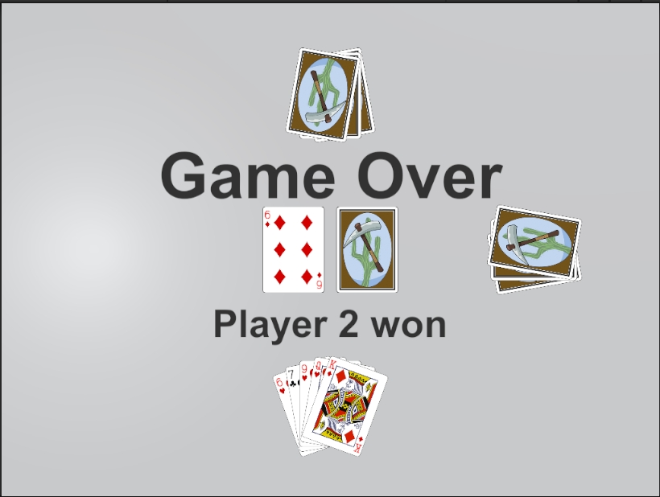

## demo7 WordGame “拼单词”

- 根据下方的字母拼单词。所含的单次的所有可能性如上方列表成列所示。

> 游戏界面-游戏进行时
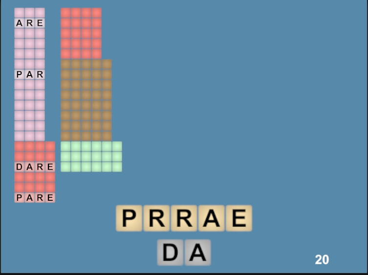

## demo8 Dungeon Delver “塞尔达密室”
1. 设计双Camera 即Main Camera 和 GUI Camera
    - Main Camera用于显示游戏界面
    - GUI Camera 用于显示玩家血量和携带物(钥匙)数量
> 游戏界面-游戏进行时
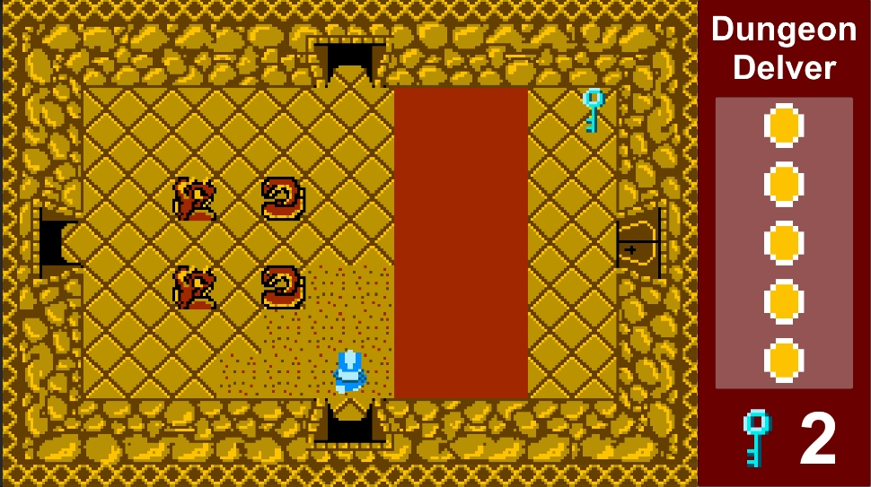

2. 设计新的接口interface，用于管理玩家的朝向以及玩家钥匙的拾取、使用和携带
3. 设计敌人，并根据文件刷新到游戏各个场景中，根据一定的行为进行移动
4. 可以通过文件，生成玩家行走的迷宫，并且根据不同的字母，设置出可以行走的区域。
> 场景界面-游戏地图
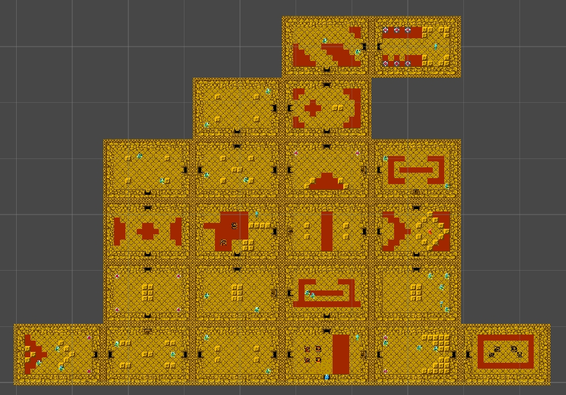

5. 设计玩家攻击和钩锁功能，增加玩法的丰富性。
6. 利用animation来控制角色的帧运动(攻击、移动)，增加游戏的连贯性。